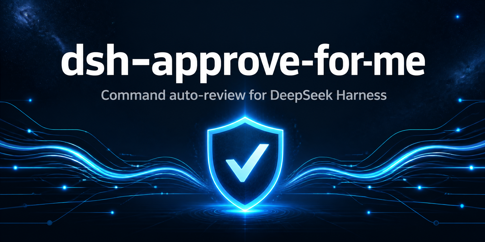

<div align="center">



# @dsh-plugin/dsh-approve-for-me

**A DSH (DeepSeek Harness) plugin that reviews and auto-approves command execution, adding an "Approve For Me" sandbox permission option.**

[English](README.md) | [简体中文](README.zh_CN.md)

[](https://github.com/topics/dsh-plugin)
<a href="https://github.com/dsh-plugins/dsh-approve-for-me/actions/workflows/npm-publish.yml">
  
</a>
<a href="https://www.npmjs.com/package/@dsh-plugin/dsh-approve-for-me">
  
</a>
<a href="https://www.npmjs.com/package/@dsh-plugin/dsh-approve-for-me">
  
</a>

</div>

> [!WARNING]
> The auto-review model is not perfect and may misjudge or miss cases. Do not treat it as a security guarantee; keep human review and least-privilege controls in place for high-risk, destructive, or sensitive-data operations.

> [!IMPORTANT]
> This package is **all-in-one**: it includes not only the Host-side auto-review logic but also ships a browser-side (Web GUI) real-time review status bar
> (the `./client` sub-path + `dsh.client` metadata). Installing `@dsh-plugin/dsh-approve-for-me` gives you both host and UI functionality at once,
> with no need to install a separate front-end plugin.

A DSH (DeepSeek Harness) plugin that provides codex-like auto-review of executed commands and adds an
**"Approve For Me"** option to the sandbox permission choices.

## Features

### 1. Auto-review of executed commands (codex-like)

The plugin registers an `approval/request` answerer (prepended before the UI answerer) that auto-resolves approval prompts by mode:

| Mode | Behavior |
|---|---|
| `off` (default) | Everything goes to the original approval chain (Web GUI dialog); behavior unchanged |
| `auto` | Automatically allows when an `approve` rule matches; automatically denies when a `deny` rule matches (deny takes priority); everything else is handed back to the user |
| `full-auto` | All approval prompts are automatically allowed (equivalent to codex `--full-auto`) |
| `never` | All approval prompts are automatically denied (CI / unattended, fail-closed) |
| `review` | **Lightweight-model review** (see below) — reviewing permission escalations when `approve-for-me` is selected; reviewing before every tool call when `strict-review` (Approve For Me - Strict Mode) is selected; other presets keep native manual approval |

In `auto` mode the rules match against: the tool name (`toolName`) + the approval reason (`reason`, which for sandbox escalations includes the model's `justification`) + the **actual command text** recovered from the `tool/call` events in the session log. Rules are regex strings (with the `im` flags; `^...$` matched per line); invalid regexes are skipped automatically.

### 2. "Approve For Me" and Approve For Me - Strict Mode = lightweight-model review (`review` mode with a preset selected, ported from codex guardian)

Implemented following the guardian (auto-approval review) design of the codex CLI: when no preset is selected, all approvals are still handled by the native UI; the two review presets govern different scopes:

| Preset | Review timing | Behavior after approval |
|---|---|---|
| `approve-for-me` / Approve For Me | Only when a tool requests a permission escalation | The review model approves or rejects that permission escalation |
| `strict-review` / Approve For Me - Strict Mode | Before every tool call executes (including calls without a permission escalation) | Continues into the original tool and sandbox policy only when approved; if that call later triggers a permission escalation, the same ruling is reused without calling the review model again |

- **Review prompt construction** (isomorphic to codex `codex-rs/core/src/guardian/prompt.rs`):
  - system (fixed safety policy): evidence handling (only user messages are trusted, everything else is treated as untrusted evidence, truncation markers should make this more cautious), user authorization levels (high/medium/low/unknown), risk levels (low/medium/high/critical), outcome policy (low/medium→allow; high→allow only when authorization ≥ medium; critical→deny), and the `{{ policy }}` slot into which your extra rules are injected;
  - user: a **compact transcript** (`[N] role: text`, keeping the first and last user messages as anchors, filling the rest of the user messages newest-to-oldest, and counting the most recent assistant/tool-call/tool-result items against their respective budgets and a cap on recent entries) + the session id + `>>> APPROVAL REQUEST START` **planned-action JSON** (tool, callId, reason, justification, actual command) + `>>> APPROVAL REQUEST END`;
  - output contract: **strict JSON** `{ risk_level, user_authorization, outcome, rationale }` (low-risk cases may reply directly with `{"outcome":"allow"}`), with a small amount of outer prose tolerated; non-JSON is treated as a failure.
- **fail-closed**: review timeout (default 30s), LLM call failure, or unparseable output → **deny** by default (configurable `reviewFallback: "ask"` to hand off to a human); may be retried `reviewMaxAttempts` times.
- **Denial circuit breaker** (ported from codex's guardian circuit breaker): after `reviewCircuitMaxConsecutive` (default 3) consecutive denials within the same turn, or `reviewCircuitMaxRecent` (default 10) denials within the window, control is handed back to a human (forwarded to the UI dialog) to keep the review model from blocking an entire round; it resets automatically on turn switch.
- **UI state and rulings**: in normal mode the in-progress and completed states are driven by the native `approval/asked` / `approval/decided` events, and the review opinion is written via the log-only `hook/result`. Strict Mode uses `hook/invoked` / `hook/result` to show "reviewing" and the conclusion next to the corresponding tool call; when denied, the tool body does not execute. None of these events enter the model context, and they do not rely on plugin custom events that cannot be registered, so they do not block session reloads. No extra messages are injected by default; `reviewNotify: true` can show the final ruling of an ordinary permission review at the next model step.
- Review model: when `reviewProvider`/`reviewModel` are not configured, they are inherited from the session's current model route via the folded `request/context` events of the session log.

### 3. The new `approve-for-me` sandbox permission option (Approve For Me)

- Appends `approve-for-me` to `ESCALATION_TARGETS`, and applies **in-place patches** to every registered tool definition that carries `sandbox_permissions` (`pwsh` / `bash` / `fs`, etc.):
  - adds `approve-for-me` to the `sandbox_permissions` enum, explaining its use in the description;
  - wraps `execute`: when a call carries `sandbox_permissions: "approve-for-me"` (still requiring `justification`), it is auto-rewritten to the real mode (`grantMode`, default `danger-full-access`) and an `[approve-for-me]` marker is stamped into the justification; the original tool's `approveEscalation` flow runs as-is, and the answerer auto-approves once it sees the marker.
- All tool patches are replayed on every `tools/change`, independent of this plugin's load order.
- Key security point: **the sandbox mode itself is never bypassed** — every grant still goes through the original `approveEscalation` strict widening check + approval channel; only the "ask a human" step is auto-answered (rules / full-auto / lightweight model); `mode: "never"` takes priority over everything.

### 4. The `approve-for-me` and `strict-review` permission presets (GUI-visible)

`permissionPresets` builds the dropdown options (schemastery enum) when the service initializes, and profile row configs are not merged (an id-located patch replaces the whole row's `config`). This plugin's bundle patch (`cordis.patch.yml`) now ships with a `permission` row override: installing the plugin automatically writes `approve-for-me` and `strict-review` into the preset table, with no need to edit the profile's `cordis.patch.yml` by hand. The override row is ordered "before Full Access" and restates the base three presets as well (because row configs are not merged):

```yaml
- id: permission
  name: '@deepseek-ai/dsh-permission-presets'
  config:
    presets:
      read-only:
        sandbox: read-only
        approval: ask
      workspace-write:
        sandbox: workspace-write
        approval: ask
      approve-for-me:
        sandbox: workspace-write
        approval: ask
        name: Approve For Me
        description: Review each permission escalation automatically.
      strict-review:
        sandbox: workspace-write
        approval: ask
        name: Approve For Me - Strict Mode
        description: Review every tool call automatically before it executes.
      danger-full-access:
        sandbox: danger-full-access
        approval: never
```

> If a deployment need overrides this row from the profile (e.g. adding/adjusting presets beyond `dsh-base`), restate the whole row and keep this plugin's two presets (see above); row configs are not merged automatically.
>
> Note: the runtime table write inside this plugin's `apply()` only makes the new presets visible in the **in-session** `/permission` dialog; the **settings-page dropdown** must rely on the row config above (applied automatically).

- The Web GUI's sandbox-permission dropdown shows **"Approve For Me"** and **"Approve For Me - Strict Mode"**;
- Can be switched via `/permission approve-for-me` or `/permission strict-review`, or via `permissionPresets.set` (UI);
- In `mode: review`, the review model is only invoked once the session has selected one of the review presets above; other presets continue with native manual approval.
- In the rule-based modes (`off` / `auto` / `full-auto` / `never`), `approve-for-me` keeps its original `full-auto` semantics; `strict-review` only activates pre-execution review in `review` mode.

### 5. System-prompt context section

Explains the current auto-approval mode to the model (off / auto / full-auto / never / review / preset active); when `review` has no preset selected, it explicitly states that native manual approval is still in effect.

## Configuration

In the dsh profile's `cordis.patch.yml`:

```yaml
approve-for-me:
  mode: review                  # off | auto | full-auto | never | review
  # review mode (lightweight-model review):
  reviewProvider: deepseek      # optional; defaults to inheriting the requesting agent's provider
  reviewModel: deepseek-chat    # optional; defaults to inheriting the requesting agent's model (a cheap one is recommended)
  reviewPolicy: |              # optional; extra rules injected into the {{ policy }} slot of the safety policy
    - Always deny any command that touches ~/keys
  reviewTimeoutMs: 30000
  reviewMaxAttempts: 2
  reviewFallback: deny          # deny (fail-closed, default) | ask (hand off to a human)
  reviewCircuitMaxConsecutive: 3
  reviewCircuitMaxRecent: 10
  reviewNotify: false             # optional: show one final ruling at the next model step; does not write a deferred "reviewing" line
  # rule-based mode (auto, etc.):
  approve: ["^git ", "^npm (install|run)", "pnpm"]
  deny: ["rm -rf", "format"]
  grantMode: danger-full-access       # the mode actually granted for approve-for-me
  presetName: approve-for-me
  presetSandbox: workspace-write    # base mode of the review preset; a full-permission request is still a reviewable escalation
  presetApproval: ask
  strictPresetName: strict-review
  strictPresetSandbox: workspace-write
  strictPresetApproval: ask
```

## Installation

```sh
# in a dsh profile directory (e.g. the web profile)
dsh plugin --profile web add file:C:/Users/jkl-9/IdeaProjects/dsh-approve-for-me
# or with a relative path from this directory
dsh plugin --profile web add file:../dsh-approve-for-me
```

Then enable it in `cordis.patch.yml` (see above). It takes effect after restarting dsh web.

## Structure

```
lib/index.js        cordis plugin entry (answerer / tool patches / presets / system-prompt section / review calls)
lib/policy.js       pure decision logic (rule modes + review prompt construction + strict JSON parsing + denial circuit breaker; no DSH dependency)
test/policy.test.js unit tests for the decision logic
test/plugin.smoke.test.js  plugin wiring smoke tests (fake ctx + fake ctx.llm)
```

## Testing

```sh
node --check lib/index.js lib/policy.js
node test/policy.test.js
node test/plugin.smoke.test.js
```

> Under the sandbox, the child-process fork of `node --test test/` is rejected (EPERM), so run individual test files directly.

## Notes and limitations

- The auto-review model is not perfect and cannot replace human judgment, least privilege, sandbox isolation, backups, or other security controls; keep human double-checking for operations involving sensitive data, production environments, or irreversible actions.
- Approval events are written to the session audit by `ApprovalService` as usual (`approval/asked` + `approval/decided`), so auto-resolutions leave a trace too; review rulings (risk/auth/rationale) are written to the plugin log and the corresponding session-flow status line.
- Strict Mode rejections return a standard `deny` at `tools/pre-execute` and the tool body does not run; approved calls still pass through the original sandbox and other tool policies.
- `sandbox_permissions: "approve-for-me"` without a `justification` errors out directly (consistent with the original paired validation).
- In `review` mode with a preset selected, an explicit `sandbox_permissions: "approve-for-me"` (carrying the `[approve-for-me]` marker) is treated as the user's advance consent to **that one action** and is allowed through directly without the review model; with no preset selected it still goes to native approval.
- Strict Mode does not apply the above marker bypass: every call is first ruled on once by the review model, and later permission escalations with the same callId just reuse that result to avoid re-reviewing.
- The review model's output is used only for ruling; its response is not written back into the session history.
